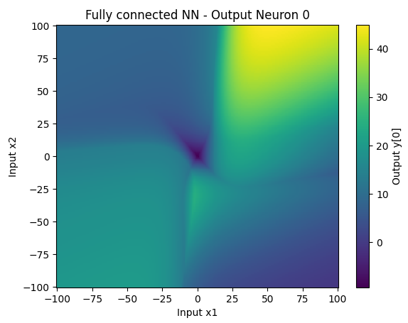

# Backprop

Simple implementation of a feedforward Fully Connected Neural Network with backpropagation training and much more, developed from scratch.

## Features

- Neurons, layers, and connections with weights and biases  
- Supports common activation functions: ReLU, Sigmoid, Tanh, Identity 
- Forward pass and backpropagation  
- Input/output normalization  
- MSE loss calculation
- Visualization for 1D and 2D inputs
- Minimal dependencies, easy to extend

  
  

